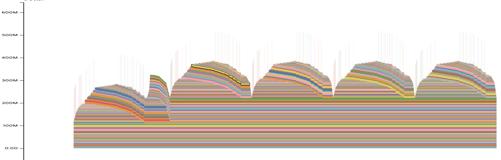

# GPU Memory Visualization: Tracking Allocations Over Time

## Run ResNet Training Example
```bash
cd pytorch-tutorials/understanding-gpu-memory-1
python3 appendix_a_code.py
```

This generates a `<identifier>_<date>.pickle` file in the current directory.

Visualize memory usage by uploading the pickle file to [PyTorch Memory Viz](https://pytorch.org/memory_viz).



💡 Key observation: Note the significant memory increase after the first iteration.